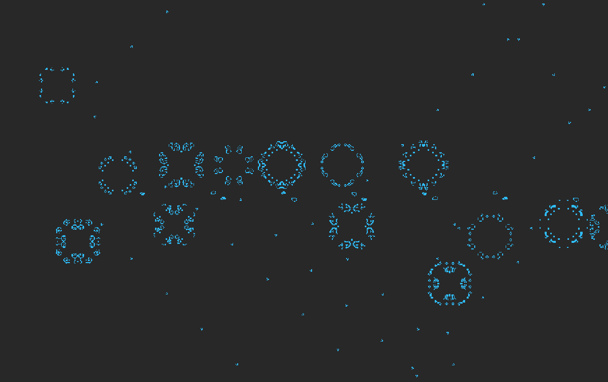
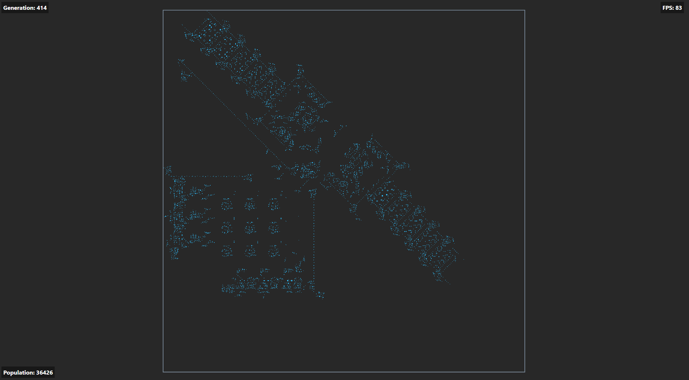
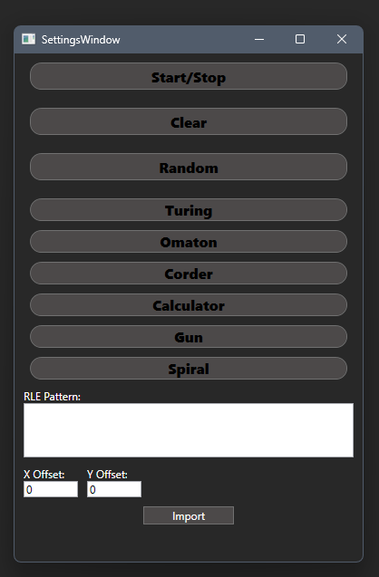
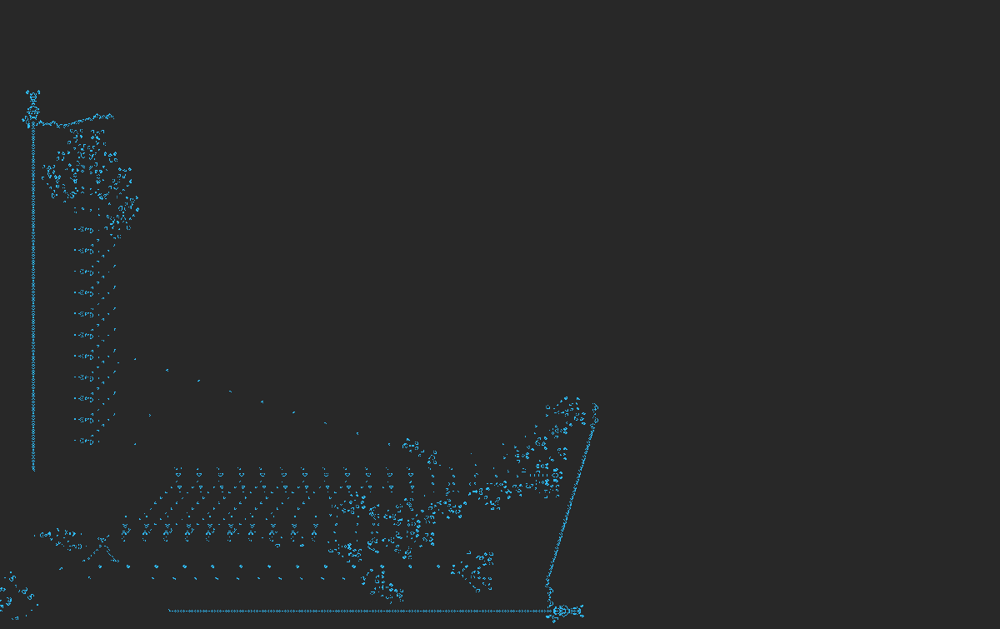

# Conway's Game of Life – WPF Edition

> [!WARNING]
> This software is unfinished.

A visual simulation of Conway's famous cellular automaton implemented in **WPF (.NET 8)**. Utilizes `WriteableBitmap` for efficient rendering and follows MVVM design principles.


<p align="center">
  
</p>

https://en.wikipedia.org/wiki/Conway%27s_Game_of_Life
---

## Features

- Interactive grid where cells live, die, and evolve by classic Game of Life rules
- Start/Stop/Reset/Clear controls
- Pattern import module with `X offset`, `Y offset`, and custom `RLE` string support
- Real-time display of:
  - Generation count
  - FPS (frames per second)
  - Population
- Mouse interaction:
  - Drawing cells (left click)
  - Erasing cells (right click)
  - Panning and zooming
- MVVM architecture with `INotifyPropertyChanged`
- Efficient bitmap-based rendering using `WriteableBitmap`

##  Built-in Patterns
You can load some sample Life patterns using the built-in pattern loader:

- Turing

- Omaton

- Corder

- Calculator

- Gun

- Spiral

You can get more patterns from [ConwayLife Patterns Library](https://conwaylife.com/patterns/).
> [!NOTE]
> Only files using `.rle` format and below board limit of `2060x2060` cells

## Controls

| Action             | Shortcut/Interaction        |
|--------------------|-----------------------------|
| Start / Stop       | `Space` (or via settings)                      |
| Clear Grid         | `C` (or via settings)       |
| Reset Simulation   | `R` (or via settings)                          |
| Show Settings Menu | `F1`                        |
| Pan View           | `Middle Mouse Button + Drag`|
| Zoom               | `Ctrl + Mouse Scroll`       |

## Screenshots


*Main simulation window with active cells.*

<p float="left">
 
  
</p>

*Settings window with pattern import module. And build in Calculator model*

---

## Getting Started

### Prerequisites

- Windows 10 or later
- [.NET 8 SDK](https://dotnet.microsoft.com/en-us/download/dotnet/8.0)

### Installation and Running

1. Clone the repository:
```bash
git clone https://github.com/gracjanStrak/ConwaysGameOfLife.git
```
2. Navigate to project directory and publish:
```bash
cd .\ConwaysGameOfLife\
dotnet publish -c Release -r win-x64 -o publish
```
3. Run the application
```bash
.\publish\ConwaysGameOfLife.exe
```
